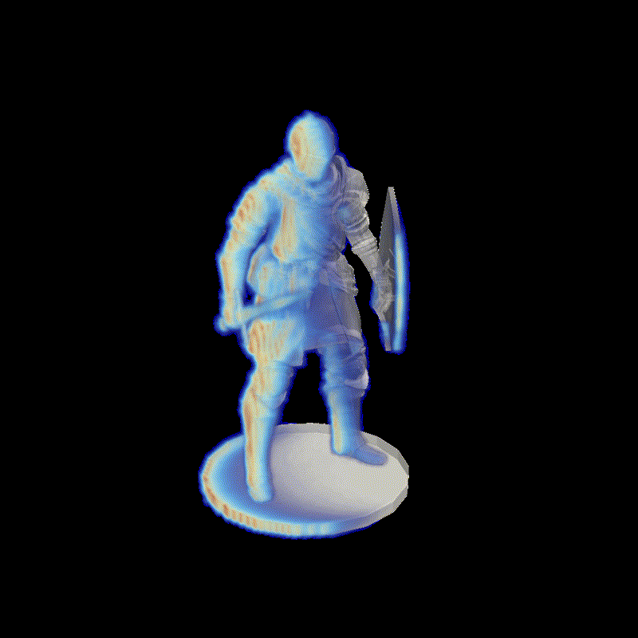

_...WIP_

# X-ray Simulation (gVXR + Geant4)

This project couples gVXR (fast Beer–Lambert rendering) with Geant4 (Monte Carlo transport) from a shared JSON scene description (`setups/setup.json`). The mesh phantom, materials, beam, detector, and acquisition schedule are defined once and reused across Python and C++ paths.



## Prerequisites
- Geant4 with multithreading and visualization.
- Assimp (for CADMesh STL loading).
- GPU/OpenGL support for gVXR rendering.
- Python 3.11 with gVXR, xraylib, NumPy, Matplotlib (see `env.yml`).

Create the Conda env (optional):
```bash
conda env create -f env.yml
conda activate MVE386
```

## Configure the scene
- Edit `setups/setup.json` to set the mesh path, units, material (formula, density, cp), beam energy/flux/exposure, detector geometry, voxel grid size, and acquisition mode (step vs fly). Relative paths are resolved against the config location.

<!--

## (ignore) Run the gVXR path (Python)
1) Generate radiograph, L-buffers, and metadata:
```bash
python gvxr_setup.py            # utility functions
python - <<'PY'
from gvxr_setup import run_gvxr
run_gvxr("setups/setup.json", output_prefix="output/test")
PY
```
This writes `output/test_image.npy`, `output/test_lbuffers.npz`, and `output/test_meta.npz`.

2) Convert L-buffers to dose/temperature estimates:
```bash
python - <<'PY'
from heat_gvxr import compute_temperature
compute_temperature(
    "setups/setup.json",
    "output/test_meta.npz",
    "output/test_lbuffers.npz",
    output_prefix="output/test")
PY
```
Outputs: `output/test_dose_Gy.npy`, `output/test_deltaT_K.npy`.  
Optional: visualize the scene with `python -c "from heat_gvxr import show_scene; show_scene('setups/setup.json')"` (needs OpenGL).

-->

## Build and run Geant4 (C++)
```bash
mkdir -p build
cd build
cmake ..
cmake --build . -j
```
Run the simulation (from `build/`):
```bash
./run                          # uses photons = flux * exposure from setups/setup.json
./run 500000 ../setups/setup.json  # override photon count or config path
```
Notes:
- `G4NUM_THREADS=N` overrides automatic core detection.
- The executable resolves `setups/setup.json` relative to the project root if not provided.

## Outputs (Geant4)
- `output/dose.vti` — voxelized energy deposition for ParaView.
- (ignore) Metadata is embedded in the VTI (material, beam energy/flux, exposure, event count).

## Scene preview (ParaView)
Generate a simple geometry preview of the JSON scene (beam, detector, source, voxel box):
```bash
python export_scene_vtk.py setups/setup.json
```
Then open `output/setup_scene.vtk` in ParaView and color by `part_id`:
1=source, 2=beam, 3=detector, 4=voxel_box.

## Workflow
1) Adjust `setups/setup.json` (beam, mesh, material, acquisition, voxel grid).  
2) `cmake --build . -j`.  
3) `./run` to generate `output/dose.vti`.  
4) `./temperature.py` to generate `<prefix>_deltaT.vti`.  
5) Inspect `.vti` files in ParaView.
